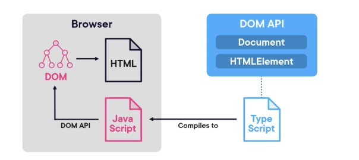
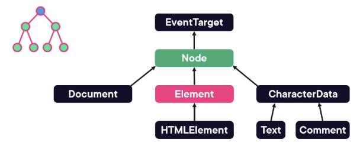

# DOM Manipulation Course Notes

## Understanding DOM Manipulation
- Document Object Model (DOM) is an object-oriented representation of a web page that can be changed with Javascript, adding/removing/modifying elements on a web page
	- The DOM is a tree of objects that represent the loaded HTML document
	- JavaScript code manipulates the DOM by using the DOM API


## Manipulate DOM
<pre>
```typescript

const div = document.querySelector("#app") // Get an element from CSS selector/label

const p = document.createElement("p"); // creates paragraph element in body
```
</pre>

## Exploring DOM Data Types
- Document object allows you to select, remove, and modify DOM elements
- Node Interface
	- Every object in a DOM tree is a Node
		- The Node interface extends the event target interface that defines method to add remove event listeners
		

	- nodeTypes return a number: ELEMENT_NODE (1), COMMENT_NODE, DOCUMENT_NODE
	- nodeName: Returns the name of a string (tag of element)
	- textContent
	- ChildNodes: Direct children of a node
	- parentNode
	- appendChild() / removeChild()
- HTML Elements
	- HTMLElement → Element (SVGElement, MathMLElement)→ Node → EventTarget
	- HTMLElements: HTMLButtonElement, - HTMLParagraphElement, HTMLDivElement

## Demo Examples
<pre>
```typescript

console.log(div.textContent); // Gives all content (including space in code)

console.log(div.innerText); // Gives purely displayed text content rendered on UI
```
</pre>